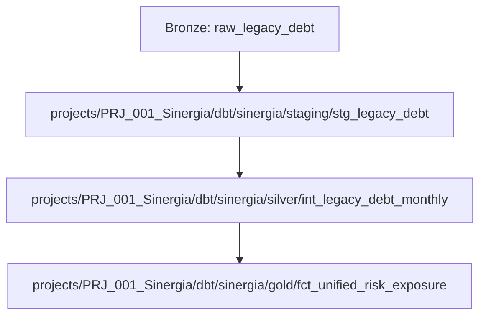

# DATAENGOS_v2_ENTERPRISE_EVOLUTION.md

> **DataEngOS v2 — Enterprise Evolution (alinhado à estrutura atual do repo)**
>
> Framework Spec‑Driven para Engenharia de Dados com **governança executável**,
> **contratos de dados**, **qualidade**, **segurança/privacidade (LGPD)** e **operações por agentes**.
>
> **Atualização**: esta versão reflete a **estrutura de diretórios em produção** (pastas `core/`, `global_governance/`, `projects/PRJ_001_Sinergia/`, etc.), mantendo os padrões *enterprise‑ready*.

---

## Sumário

1. Visão Executiva
2. Princípios Norteadores
3. Estrutura de Diretórios **Atual** (Kernel)
4. Sistema de Governança (nível organização)
5. Estrutura Padrão **por Projeto** (nível projeto)
6. Contratos & Camada Semântica (ODCS)
7. Segurança & Privacidade (LGPD)
8. Qualidade de Dados (Política, Plano & Métricas)
9. Papéis & Responsabilidades (RACI)
10. Arquitetura de Pipelines & NFRs
11. Ciclo de Vida Operado por Agentes (Workflow)
12. Gatekeeper (Governança Executável)
13. Definition of Ready / Definition of Done
14. Roadmap & Releases
15. Integrações Agênticas (Antigravity, MCP, RLM, TOON)
16. Exemplos Práticos (com paths reais)
17. Apêndices (Modelos/Esboços)
18. Mapa de Compatibilidade (v1 → v2)

---

## 1) Visão Executiva

O **DataEngOS v2** mantém o princípio: **nenhum código sem especificação e contrato aprovados**.
Esta revisão alinha o documento à árvore **atual** do repositório, sem abrir mão dos
controles *premium* (LGPD, RBAC/ABAC, SLOs, auditoria, NFRs, Gatekeeper).

---

## 2) Princípios Norteadores

- **Spec‑Driven Everything**: código é derivado de especificações versionadas (YAML/MD).
- **Governança Executável**: naming/PII/estilo/qualidade aplicados por linters & Gatekeeper.
- **Fail‑Fast**: contratos ODCS detectam quebras; correção antes de produção.
- **Semântica Primeiro**: glossário/modelo conceitual claros e versionados.
- **Privacidade por Design**: LGPD desde o canvas até o código.
- **Observabilidade by default**: lineage, métricas e logs publicados por padrão.

---

## 3) Estrutura de Diretórios **Atual** (Kernel)

```bash
# Raiz do monorepo
core/
  design-system/
  global_governance/
    templates/
      canvas.md
      e_commerce_transaction.yaml
      odcs_contract_v1.yaml
    classification.yaml
    naming-conventions.json
    naming-project.json
    naming.json
    stack-standards.md
    stack.md
  prompts/

docs/
  .base_docs/
  researchs/          # (sugestão: renomear para “research/” ou “researches/”)
  ROADMAP.md

projects/
  DEMO_Finance/
    contracts/        # exemplos de contratos de referência/demo
  PRJ_001_Sinergia/
    contracts/
      inputs/sinergia/
        api_transactions.yaml
        legacy_debt.yaml
      outputs/sinergia/
        fct_unified_risk.yaml
    dbt/sinergia/
      staging/
        stg_legacy_debt.sql
        stg_legacy_debt.yml
      silver/
        int_legacy_debt_monthly.sql
        int_live_risk_transactions.sql
      gold/
        fct_unified_risk_exposure.sql
    pipelines/sinergia/
      decomposition_strategy.md
      logic.md
    product-canvas/
      legacy_debt.md

scripts/
  setup_dev.sh
  verify_architect.py

src/dataeng_os/
  commands/
  models/
  ui/
  __init__.py
```

**Observações**

- **Governança organizacional** vive em `core/global_governance/`.
- **Execução por agentes**: prompts em `core/prompts/` e motor/CLI em `src/dataeng_os/`.
- **Unidade de projeto**: cada projeto sob `projects/<ID_Projeto>/`.

---

## 4) Sistema de Governança (nível organização)

**Pasta:** `core/global_governance/`

- **Naming & Style** (`naming-conventions.json`, `naming.json`, `naming-project.json`)
  - Prefixos: `stg_`/`int_`/`fct_`/`dim_`. Colunas em `snake_case`. Timestamps `*_at`.
- **Classificação & PII** (`classification.yaml`)
  - Campos `pii: true` → **mascaramento/anonimização** aplicados na **Silver**.
- **Stack & SQL Style** (`stack.md`, `stack-standards.md`)
  - CTEs obrigatórias; sem `SELECT *`; materializações por camada; timezone UTC.
- **Templates corporativos** (`templates/`)
  - `canvas.md` (canvas de produto de dados), `odcs_contract_v1.yaml`, exemplos de domínio.

> *Recomendação enterprise (opcional, compatível com a árvore atual):*
> adicionar `policies/` em `core/global_governance/` para os 3 documentos corporativos:
> `data_quality_policy.md`, `privacy_lgpd_policy.md`, `security_access_policy.md`.

---

## 5) Estrutura Padrão **por Projeto** (nível projeto)

**Pasta base do projeto (ex.: `projects/PRJ_001_Sinergia/`)**

```bash
projects/PRJ_001_Sinergia/
  product-canvas/           # Porquê/Quem/Valor (visão)
    legacy_debt.md          # (pode incorporar Charter + Business Case)
  contracts/                # ODCS inputs/outputs do projeto
    inputs/<domínio>/...    # (ex.: inputs/sinergia/*.yaml)
    outputs/<domínio>/...   # (ex.: outputs/sinergia/*.yaml)
  pipelines/<domínio>/      # Topologia + narrativa
    decomposition_strategy.md
    logic.md
  dbt/<domínio>/            # Código gerado ou editado (staging/silver/gold)
    staging/
    silver/
    gold/
  # Sugeridos (enterprise):
  # architecture/           -> context_diagram.mermaid, nfrs.md
  # semantics/              -> conceptual_model.mermaid, glossary.md
  # security_privacy/       -> project_plan.yaml (LGPD do projeto)
  # roadmap/                -> releases.yaml
```

**Compatibilidade com a árvore atual**: nada é quebrado; apenas **acrescentamos**
subpastas opcionais para elevar maturidade *enterprise* sem alterar o que já existe.

---

## 6) Contratos & Camada Semântica (ODCS)

- **Onde ficam**: `projects/<projeto>/contracts/inputs|outputs/<domínio>/*.yaml`
- **Papel**: definem schema, regras de qualidade, owners e expectativas do consumidor.
- **Fail‑Fast**: mudanças incompatíveis quebram conscientemente (alerta de contrato).

**Exemplo (output)** `projects/PRJ_001_Sinergia/contracts/outputs/sinergia/fct_unified_risk.yaml` (esboço):

```yaml
version: 1
metadata:
  name: fct_unified_risk
  domain: sinergia
  owner: { business: "Risco", technical: "data-eng@empresa.com" }
schema:
  columns:
    - name: customer_id
      type: string
      tests: [not_null, unique]
    - name: exposure
      type: numeric
      tests:
        - dbt_expectations.expect_column_values_to_be_between: { min_value: 0 }
quality_rules:
  - name: exposure_non_negative
    expression: "exposure >= 0"
```

> **Dica**: mantenha **contratos demo** em `projects/DEMO_Finance/contracts/` como catálogo de exemplos.

---

## 7) Segurança & Privacidade (LGPD)

- **Classificação corporativa**: `core/global_governance/classification.yaml`.
- **Plano por projeto (recomendado)**: `projects/<projeto>/security_privacy/project_plan.yaml` com:
  - **base legal**, **finalidade**, **retenção/purge**, **matriz de acesso por função**,
    **PII fields** (ligados aos contratos) e **IDs de aprovação** (tickets).

**Exemplo** `projects/PRJ_001_Sinergia/security_privacy/project_plan.yaml` (esboço):

```yaml
contracts:
  - name: inputs/sinergia/legacy_debt
    pii_fields: ["cpf", "email"]
    legal_basis: "legitimate_interest"
    purpose: "risk_scoring"
    retention: "730d"
    masking: { cpf: partial_mask, email: hash_sha256 }
    access_matrix:
      - role: risk_analyst   # masked
      - role: data_scientist # unmasked (justificativa/ticket)
    approvals: ["SEC-9821", "PRIV-7744"]
```

---

## 8) Qualidade de Dados (Política, Plano & Métricas)

- **Política corporativa (sugerida)**: `core/global_governance/policies/data_quality_policy.md`.
- **Plano do projeto**: regras mínimas por tabela (estruturais + 1 regra de negócio),
  métricas e rota de remediação.
- **Implementação técnica**: testes dbt/YAML ao lado dos modelos em `projects/<projeto>/dbt/<domínio>/...`.

**Exemplo** `projects/PRJ_001_Sinergia/dbt/sinergia/staging/stg_legacy_debt.yml` (esboço):

```yaml
version: 2
models:
  - name: stg_legacy_debt
    columns:
      - name: customer_id
        tests: [not_null]
      - name: cpf
        tests: [not_null]
```

---

## 9) Papéis & Responsabilidades (RACI)

- **Data Owner (negócio)**, **Data Steward (qualidade/semântica)**,
  **Data Custodian (plataforma)**, **Segurança/Privacidade**, **Equipe de Dados**.
- Onde documentar no projeto: em `product-canvas/<artefato>.md` (ou criar `charter.md`).

---

## 10) Arquitetura de Pipelines & NFRs

- **Lógica & topologia**: `projects/<projeto>/pipelines/<domínio>/logic.md` e `decomposition_strategy.md`.
- **NFRs (sugerido)**: `projects/<projeto>/architecture/nfrs.md` (latência, disponibilidade, custo, confiabilidade, observabilidade, incidentes/on‑call).

---

## 11) Ciclo de Vida Operado por Agentes (Workflow)

- **Shape‑Spec** → preenche `product-canvas/` (ex.: `legacy_debt.md`).
- **Write‑Contract** → cria/valida `contracts/inputs|outputs/<domínio>/*.yaml`.
- **Implement‑Stack** → gera/ajusta `dbt/<domínio>/staging|silver|gold` e DAGs.
- **Export/Run** → CI/CD executa `dbt compile/test` + orquestração.

Artefatos do agente

- **Prompts**: `core/prompts/`
- **CLI/Engine**: `src/dataeng_os/`
- **Scripts**: `scripts/setup_dev.sh`, `scripts/verify_architect.py`

---

## 12) Gatekeeper (Governança Executável)

**Pontos de verificação (CI/pre‑merge)**

- Contratos ODCS presentes para inputs/outputs usados no projeto: `projects/<projeto>/contracts/...`.
- **Owner** no contrato e RACI no canvas/charter (`projects/<projeto>/product-canvas/...`).
- Se `PII` em `core/global_governance/classification.yaml` → exigir
  `projects/<projeto>/security_privacy/project_plan.yaml`.
- Testes dbt mínimos + `dbt compile` verde em `projects/<projeto>/dbt/...`.
- (Opcional) `architecture/nfrs.md` e `roadmap/releases.yaml` existentes.

---

## 13) Definition of Ready / Definition of Done

**DoR**

- Canvas (visão), SLAs (no canvas), RACI (no canvas/charter), Business Case (pode ficar no canvas).
- ODCS inputs/outputs prontos; requisitos de dados claros (pode ser seção no canvas).
- Políticas aplicáveis herdadas de `core/global_governance/` e plano LGPD se houver PII.

**DoD**

- dbt/Airflow compilam/rodando; testes mínimos ✅; mascaramento aplicado na Silver.
- Lineage/doc gerados (dbt docs) em `exports/` do pipeline (ou publicado no catálogo).
- Evidências de aprovações e valor de negócio entregue (seção final do canvas ou `roadmap/releases.yaml`).

---

## 14) Roadmap & Releases

- Sugerido: `projects/<projeto>/roadmap/releases.yaml` para controlar incrementos de valor, dependências e KPIs por release.

---

## 15) Integrações Agênticas (Antigravity, MCP, RLM, TOON)

- IDE agent‑first; MCPs para dbt, Airflow, Banco, Docker.
- RLM (exploração recursiva) e TOON (compactação de contexto) para grandes manifests/schemas.

---

## 16) Exemplos Práticos (com paths reais)

### 16.1 Topologia (Mermaid)



### 16.2 Contrato ODCS (output)

`projects/PRJ_001_Sinergia/contracts/outputs/sinergia/fct_unified_risk.yaml`

```yaml
version: 1
metadata: { name: fct_unified_risk, domain: sinergia }
schema:
  columns:
    - { name: customer_id, type: string, tests: [not_null, unique] }
    - { name: exposure, type: numeric }
quality_rules:
  - { name: exposure_non_negative, expression: "exposure >= 0" }
```

### 16.3 dbt tests (staging)

`projects/PRJ_001_Sinergia/dbt/sinergia/staging/stg_legacy_debt.yml`

```yaml
version: 2
models:
  - name: stg_legacy_debt
    columns:
      - { name: customer_id, tests: [not_null] }
      - { name: cpf, tests: [not_null] }
```

### 16.4 Macro de mascaramento (esboço)

*(biblioteca de macros do projeto ou corporativa)*

```jinja

  
    SHA2({{ column_name }}, 256)
  
    REGEXP_REPLACE({{ column_name }}, '(\d{3})(\d{3})(\d{3})(\d{2})', 'XXX.\\2.\\3-\\4')
  
    {{ column_name }}
  

```

---

## 17) Apêndices (Modelos/Esboços)

### 17.1 Canvas (pode consolidar Charter/Business Case)

`projects/<projeto>/product-canvas/<tema>.md`

```md
# Canvas - <Tema>
Objetivo/Problema & Valor:
Escopo IN/OUT:
Stakeholders & RACI:
SLAs/SLOs:
Perguntas de negócio & Métricas:
Riscos & Premissas:
Roadmap resumido:
```

### 17.2 Plano LGPD do Projeto

`projects/<projeto>/security_privacy/project_plan.yaml`

```yaml
contracts:
  - name: inputs/<domínio>/<fonte>
    pii_fields: []
    legal_basis: ""
    purpose: ""
    retention: ""
    masking: {}
    access_matrix: []
    approvals: []
```

---

## 18) Mapa de Compatibilidade (v1 → v2)

- **Antes**: propunha `specs/` na raiz. **Agora**: alinhado à prática atual usando `core/global_governance/` (nível organização) e `projects/<projeto>/...` (nível projeto).
- **Políticas enterprise**: recomendadas em `core/global_governance/policies/` (opcional, retrocompatível).
- **Artefatos de projeto**: canvas/contratos/pipelines/dbt permanecem sob `projects/PRJ_001_Sinergia/`.
- **Semântica/Arquitetura/Roadmap/Privacidade**: sugeridos como **subpastas adicionais** em cada projeto, sem quebrar a árvore existente.

---

> **Nota de implementação**: ativar o Gatekeeper apontando para os **paths reais**
> (ex.: `projects/**/contracts/**/*.yaml`, `core/global_governance/classification.yaml`) e validar `dbt compile/test` sob `projects/**/dbt/**`.
